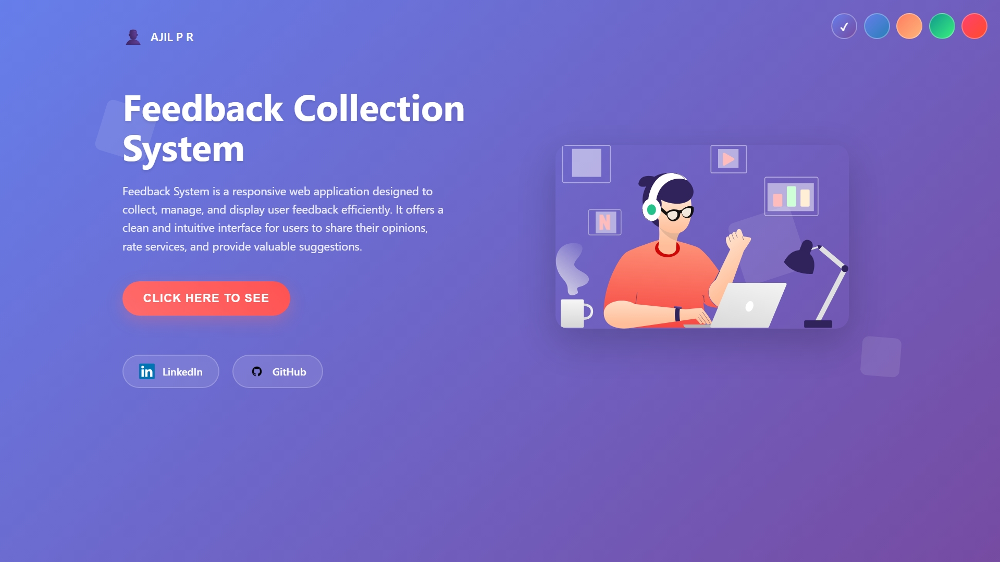
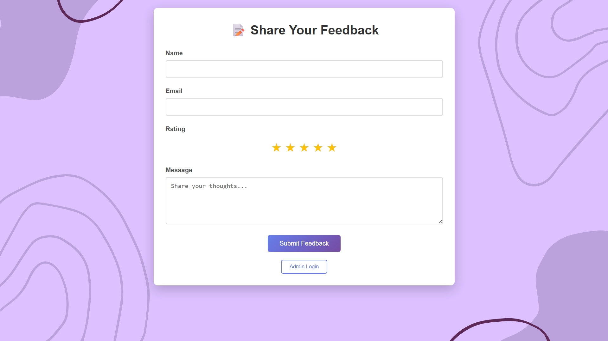
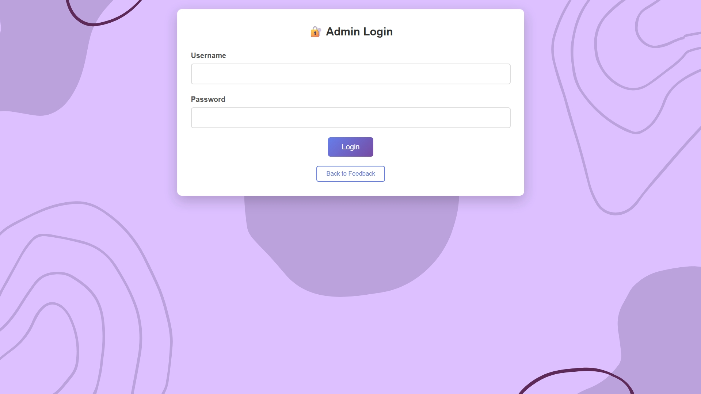
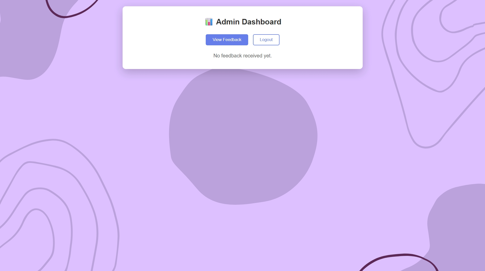

# 📝 Feedback Collection System

A responsive, full-stack **Feedback Collection Web App** that enables users to submit feedback and allows admins to manage it securely. Built using **HTML, CSS, JavaScript, Node.js, Express, and MongoDB**, this system is perfect for collecting insights from users, customers, or clients.

---

## 🌟 Features

### ✅ User Interface
- 📄 Submit feedback with name, email, message, and star rating.
- ⭐ Interactive star-based rating system.
- 📱 Fully responsive design with mobile support.
- 🎨 Theme switching and animated transitions.
- 🎬 Loading screens and button animations.

### 🔐 Admin Panel
- 🔐 Secure login with JWT-based authentication.
- 📋 View all submitted feedback.
- 🗑️ Delete inappropriate or duplicate feedback.
- 📈 Feedback sorting by date (latest first).

---

## 🔧 Technologies Used

| Layer       | Tech Stack                                      |
|-------------|-------------------------------------------------|
| **Frontend**| HTML5, CSS3, JavaScript (Vanilla)               |
| **Backend** | Node.js, Express.js                             |
| **Database**| MongoDB (via Mongoose)                          |
| **Security**| bcryptjs, jsonwebtoken                          |
| **Dev Tools**| nodemon, dotenv                                |
| **Deployment**| [Railway](https://railway.app/)               |

---

## 🖼️ Screenshots

### 🎉 Landing Page

### ✍️ Feedback Form

### 🔐 Admin Login

### 📊 Admin Dashboard

---

## 🚀 Getting Started

### Prerequisites
- Node.js and npm installed
- MongoDB instance (local or [MongoDB Atlas](https://www.mongodb.com/cloud/atlas))
- Git (for cloning)

## 🛠️ Tech Stack

| Layer        | Technology          |
|--------------|---------------------|
| Backend      | MONGODB                 |
| Frontend     | HTML, CSS, JS       |
| Database     | MySQL               |
| Server       | Apache (XAMPP)      |

---

## 📁 Project Structure

feedback-system/
│
├── admin/                  # Admin panel (feedback management)
├── student/                # Student dashboard
├── config/                 # DB connection, constants
├── css/                    # Stylesheets
├── js/                     # Scripts
├── images/                 # Static images/screenshots
├── db_connection.php       # Database connection script
├── index.php               # Login/landing page
└── feedback.sql            # Database dump
